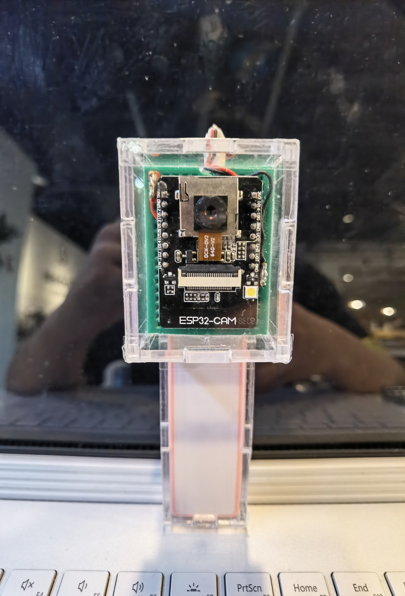

# BioMakers-final-project

此项目为创意性实践 II 期末个人项目，仅供学习参考。

<!--
  如果您看到了这段话
  请使用合适的 Markdown 预览软件（VS Code, Typora等）查看本文档
  或者移步同名 html 文件进行查看
-->

<!-- PROJECT LOGO -->
<a href="mailto:huang_nan_2019@pku.edu.cn">
  
</a>

<h2 align="center">简易云相机</h2>
<h4 align="center">野生动物图像采集装置</h4>
<h5 align="center">
  基于WiFi与服务器，捕获野生动物图像
</h5>

<!-- TABLE OF CONTENTS -->
<details open="open">
  <summary>目录</summary>
  <ol>
    <li>
      <a href="#有关项目">有关项目</a>
      <ul>
        <li><a href="#软硬件框架">软硬件框架</a></li>
      </ul>
    </li>
    <li>
      <a href="#快速上手">快速上手</a>
      <ul>
        <li><a href="#依赖环境">依赖环境</a></li>
        <li><a href="#安装部署">安装部署</a></li>
      </ul>
    </li>
    <li>
      <a href="#用法">用法</a>
      <ul>
        <li><a href="#示例">示例</a></li>
      </ul>
    </li>
    <li><a href="#开源许可">开源许可</a></li>
    <li><a href="#致谢">致谢</a></li>
  </ol>
</details>

<!-- About the Project -->

## 有关项目


简易云相机——野生动物图像捕获装置

20 学年春季学期创意性实践 Ⅱ 课程项目

此项目文件包中包含以下内容：

- [开源许可](./LICENSE)
- [Arduino 源文件](./Arduino/hardware.ino)
- [服务器端 Python 依赖](./Python/requirements.txt)
- [服务器端 Python 脚本](./Python/server.py)
- [外壳切割图纸](./blueprint/case.with.assembly.instruction.dxf)

其他对此项目有帮助或者相关的链接见[致谢部分](#致谢)。

<sub>P.S. 此文档中包含<b>大量</b>可点击连接，可快速跳转至相应界面。</sub>

### 软硬件框架

本项目所依赖的主要软硬件框架见下

- [ESP32-CAM](https://docs.ai-thinker.com/esp32-cam)
- [Streamlit](https://streamlit.io/)
- 以及一台**服务器**！<del>（或者使用局域网连接）</del> <del>（最低要求不清楚，但是带宽越大越好）</del>

<!-- 快速上手 -->

## 快速上手

以下是如何快速上手本项目的步骤说明。

### 依赖环境

这里列举了一些在运行程序之前你需要做的事情

1. 找出所用服务器的公网（如果是局域网连接的话，内网亦可）IPv4 地址和一个可用的端口（服务器的话可能需要设置网关规则来开放一个，默认 `80` 端口，注意需要在 Python 脚本中同步端口的更改）
2. 挑选稳定的网络环境（PKU 这类需要网关验证的 WiFi 不可，我自己用的是手机热点），记住 SSID 与密码
3. 将上述参数填入 Arduino 程序中网络相关设置（33-36 行），并烧录进 ESP32-CAM（选择 AI-Thinker 模型，其余参数默认即可）

   ```c
   /* 硬件程序.ino 33-36行 */
   const char *ssid = "your_WiFi_name_here";
   const char *password = "WiFi_password_here";
   const char *serverIP = "your_server_ip_here";
   const int *serverPort = 80;
   ```

   - 如果指定了别的服务器端口，需要在服务器端的 Python 脚本处作对应的修改

     ```python
     # 服务器端程序.py 修改 164 行处附近，281 行处同理
     # 指定绑定的服务器端口 80
     port = 80
     ```

4. 按照下图所示接线，为 ESP32-CAM 供电

   

5. （可选）使用国标 3mm 亚克力板切割出外壳并组装，成品图见下

   1. 全览

    

   2. 三视图

    
    
    

   3. 电源滑盖示意

    

   <sub>（此处设计有小缺陷，滑盖的工作没有预期的顺畅，图中所示模型实际在滑槽外侧额外贴了透明胶用于限位）</sub>

6. 服务器端安装 Python 依赖，推荐使用 Python 3.7+ 的版本，更低的版本未经测试，但也应该可以尝试<del>（都 2021 年了不会还有人用 Python 2 吧）</del>
   ```sh
   pip3 install -r requirements.txt
   ```

### 安装部署

1. 将 Python 脚本上传至服务器，并在同目录下创建 **img** 文件夹
2. 在同目录中键入以下命令来开启服务器端的运行（`<available-port>` 部分需要替换成另一个可用的服务器端口，避免和上传数据用的端口冲突）

   ```sh
   streamlit run 服务器端程序.py --server.port=<available-port>
   ```

   - （可选）如果使用的是服务器，可以结合使用 [`nohup`](https://www.runoob.com/linux/linux-comm-nohup.html) 或者 [`screen`](https://www.runoob.com/linux/linux-comm-screen.html) 的指令来让程序能够挂在后台一直运行

3. 检查 WiFi 可用性（或者是像我一样，打开手机热点）
4. 给 ESP32-CAM 供电，等待设备连接

   - （可选）由于没有设置别的调试信息输出来显示连接状态，可以在测试时先通过串口监视器观察输出信息

     - 据我观察，调试成功之后不作变动也能正常运行
     - 但可能在不同的手机热点条件下会有波动

5. 现在您可以访问 `<服务器IP>:<端口>` 来使用在线应用了！<del>ヽ(✿ ﾟ ▽ ﾟ)ノ好耶</del>

<!-- USAGE EXAMPLES -->

## 用法

在线的应用主要分三大模块：

- 查看照片
- 手动拍摄
- 自动拍摄

使用范例见下。您也可以通过随时更改网页端的程序来拓展出更多的功能，相关 API 见[官方说明](https://docs.streamlit.io/en/stable/api.html)。

### 示例

1. 查看已捕获的照片


2. 手动拍摄特定张数


3. 自动连续拍摄照片


<!-- LICENSE -->

## 开源许可

本项目遵循 MIT 开源许可，详见 [`LICENSE`](./LICENSE)。

<!-- ACKNOWLEDGEMENTS -->

## 致谢

- 感谢开设此课程的陈老师、陶老师、龙老师、董老师<sub>（排名不分先后）</sub>
- 感谢吕同学提供的 ESP32-CAM 接线示意图
- 感谢极客实验室与老生物楼创意实验室提供的板材加工与 3D 打印

- 网页交互界面实现

  <a href="https://streamlit.io/"></a>

- Arduino 平台硬件程序支持

  <a href="https://www.arduino.cc/"></a>

- 相关 Arduino 依赖包与调试工具

  <a href="https://arduino.github.io/arduino-cli/latest/"></a>

- ESP32-CAM 部分代码主要参考

  <a href="https://stackoverflow.com/"></a>

- 部分代码修改参考

  <a href="https://github.com/"></a>

- 图像比对部分参考

  <a href="https://www.pyimagesearch.com/"></a>

- 2D 加工图纸绘制

  <a href="https://www.qcad.org/en/"></a>

- 3D 模型处理

  <a href="https://www.blender.org/"></a>

<!-- MARKDOWN LINKS & IMAGES -->
